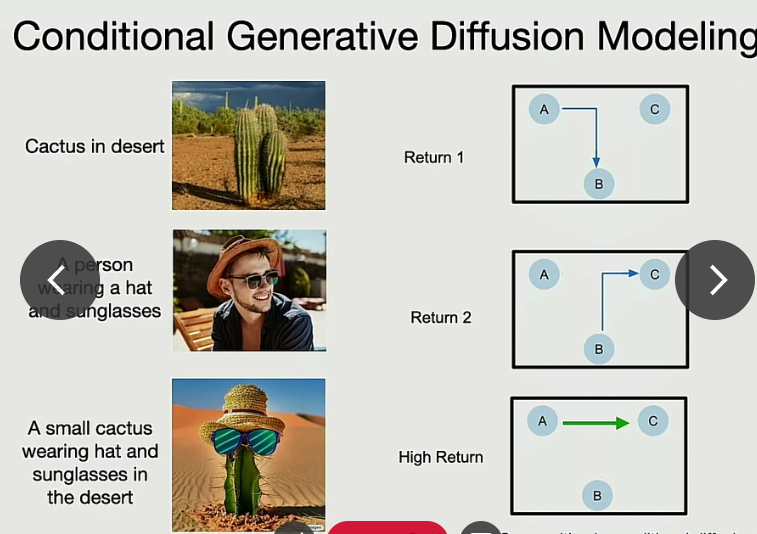

## Behavior Cloning

This is the simplest algorithm of imitation learning. It's simply 

Distribution Shift (no assumption of deterministic dynamics)

Exposure bias (NLP)

Paper: Why Exposure Bias Matters: An Imitation Learning Perspective of Error Accumulation in Language Generation

### What's the difference with off-policy RL?

- Offline RL: Given a fixed dataset of trajectories $\mathcal{D}=\{(s_i, a_i, s'_i, r_i)\}$, learn the best possible policy $\pi_\theta$.
- 
- For a more systematic review, please refer to the [blog](https://bair.berkeley.edu/blog/2022/04/25/rl-or-bc/) from BAIR and the corresponding paper: [When Should We Prefer Offline Reinforcement Learning Over Behavioral Cloning?]((https://arxiv.org/abs/2204.05618))

Outcome-conditioned RL | explain Prompting?

temporal compositionality

How would a typo in prompt matter?

Train on some toy synthetic data

## Recent Papers

### Decision Transformer

- [video](https://www.youtube.com/watch?v=w4Bw8WYL8Ps)
- Motivation: Large Transformer Modals are **stable** to train and scale up.
- Need to set initial returns-to-go to desired target return (expert)
- inference: rollouts
- Similar but still stronger than %imitation learning (by learning from bad trajectory)
- What's the relation to DPO?

### RT-1

- Motivation: Foundation model for robotic control
- Architecture:
  - RT-1 takes a short sequence of images and a task description as input, and outputs an action to execute at each time step.
  - A pretrained text embedding model **FiLM** to encode the task description, and the ImageNet-pretrained **EfficientNet** to encode the images conditioned on text embedding. A **Token Learner** module to compute a compact set of tokens, and finally a Transformer to attend over these tokens and produce discretized action tokens.
  - Discretizing each dimension of the action space into bins to model multi-modal distribution.  
  
- Data
- Inference
  - RT-1 performs closed-loop control and commands actions at 3 Hz until it either yields a “terminate” action or hits a pre-set time step limit.
  - Generaliztion
  - Combined with SayCan for long-horizon tasks
  - Other ablation

https://youtu.be/UuKAp9a6wMs

Can we do trajectory stitching without learning a Q function? 

Dataset - return | generalization?

Decision Transformers

Trajectory Transformers	

 

Composition of constraints